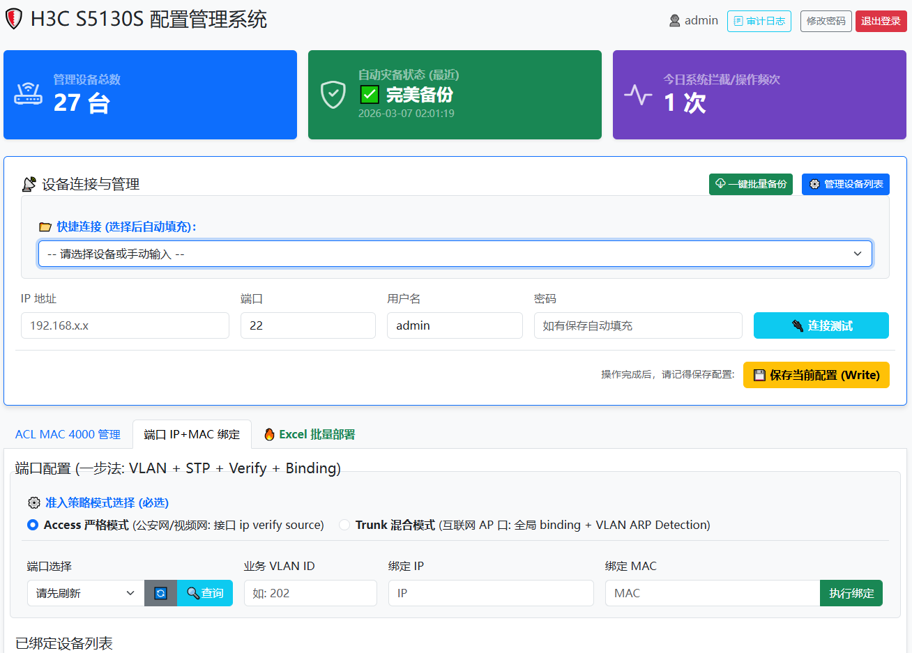
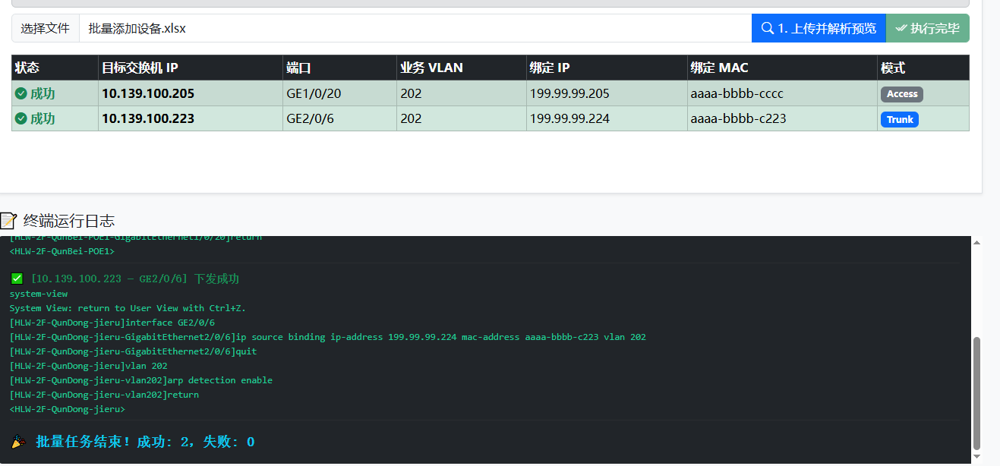
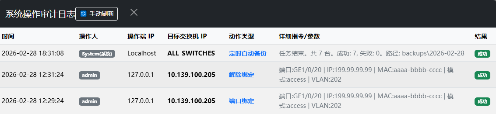
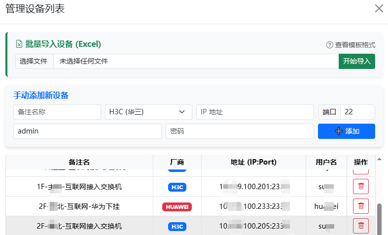
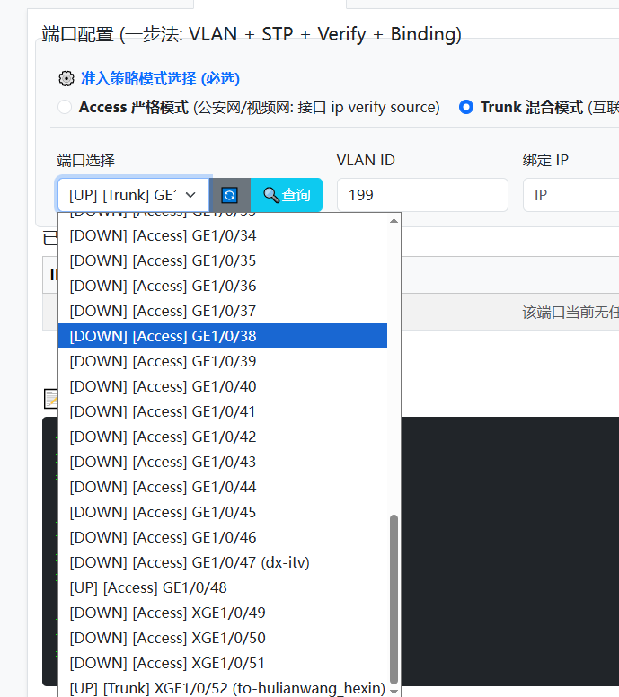
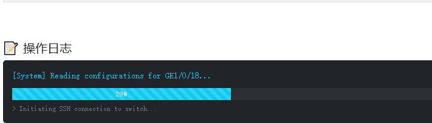

# 🛡️ 极简网管平台：交换机自动化配置系统 (v2.4.1 企业高阶版)

一款专为网络工程师打造的轻量级、可视化、高并发的交换机自动化运维管理系统。彻底告别繁琐的命令行敲击，通过 Web 界面实现全网设备的资产可视、一键准入控制、大规模批量割接与自动化灾备。

目前以 **H3C (Comware 体系)** 为核心驱动，底层已完成多厂商架构解耦，即将平滑接入 **华为Huawei (VRP 体系)** 与 **锐捷Ruijie**。

---

## ✨ 核心特性 (Key Features)

### 📊 1. 可视化数据看板 (Dashboard)
* **全局统筹**：首页直观呈现全网纳管设备总数、今日系统拦截/操作活跃度。
* **灾备监控**：实时追踪最近一次凌晨自动备份任务的状态与战报。

### 🚀 2. Excel 大规模批量割接引擎
* **标准化导入**：支持上传 `.xlsx` 或 `.csv` 模板，自动解析并渲染前端核对预览表。
* **智能防呆机制**：自动修复 Excel 幽灵浮点数（如 VLAN 202.0），下发前严格校验格式。
* **沉浸式瀑布流终端**：执行时在前端模拟极客终端，实时滚动渲染并转义底层交换机 SSH 交互回显日志，执行进度与报错细节一览无余。

### 🛡️ 3. 极严苛的安全与审计机制
* **核心链路保护 (Protected Ports)**：基于关键词（如 Uplink、Core、Trunk）智能拦截高危端口的普通配置下发，防止全网瘫痪。
* **系统操作审计 (Audit Logs)**：所有变更操作、拦截记录、定时任务均被强制打上时间戳与 IP 烙印，并提供 SIEM 级视角的溯源弹窗，彻底消灭“无头网络事故”。

### ⏰ 4. 幽灵定时灾备 (Auto Backup)
* **无人值守**：内置 `APScheduler` 调度引擎，每日凌晨 2:00 静默唤醒。
* **分类归档**：并发登录全网资产拉取最新配置，按 `YYYY-MM-DD` 自动分类建档，任务战报自动写入审计日志。

### 📁 5. 多厂商资产管理 (Asset Management)
* **色彩标识**：设备列表自动根据品牌（H3C、Huawei 等）赋予专属色彩徽章。
* **自然排序与防重**：快捷连接列表采用 `localeCompare` 算法实现中文拼音与字母自然排序；后端强制校验 IP 唯一性，导入时智能跳过重复项。
* **多端一步录入**：支持前端表单单台添加，也支持极速 Excel 批量资产导入。

---

## 📸 界面预览 (Screenshots)


**1. 首页数据看板与资产速连**


**2. Excel 批量自动化部署与瀑布流日志**


**3. 企业级安全审计日志中心**


**4. 多厂商资产管理控制台**


**5. 端口安全绑定**





**6. **交换机自动备份**


**7. 操作时增加进度条**


---

## 🛠️ 技术栈 (Tech Stack)

* **后端框架**: Python 3.8+ / Flask
* **数据库**: SQLite3 (极轻量，无需额外配置)
* **网络自动化引擎**: Paramiko (SSH2 协议) / Netmiko (架构预留)
* **任务调度引擎**: APScheduler
* **前端渲染**: HTML5 / Bootstrap 5 / 原生 Async JavaScript
* **文件解析**: openpyxl / csv

---

## 📦 快速部署 (Installation)

1. **克隆项目 / 下载源码**
   ```bash
   git clone [https://github.com/yourusername/sygaSwitchAdmin.git](https://github.com/yourusername/sygaSwitchAdmin.git)
   cd sygaSwitchAdmin
   
2. **创建并激活虚拟环境 (强烈推荐)**

   ```bash
#Windows (Anaconda/Miniconda)
conda create -n switch_admin python=3.10
conda activate switch_admin

3. **安装依赖**

   ```bash
pip install -r requirements.txt

4. **一键启动服务**

```bash
python run_server.py
```


## 服务启动后，默认监听 http://0.0.0.0:8080，局域网内任意浏览器即可访问。


## 🗺️ 未来路线图 (Roadmap v3.0+)

[1] 多厂商驱动支持: 接入 HuaweiManager 实现华为设备的无缝调度。

[2] Config Diff 历史配置差异比对: 提供类似 Git 的红绿高亮视图，比对昨日与今日的交换机配置变化。

[3] MAC / IP 全网物理定位 (MAC Tracker): 输入 MAC 地址，并发追踪并精准定位其所在的楼层交换机与物理端口。

[4] 密码库高强度加密: SQLite 中的凭证由明文升级为 AES256 密文存储。

## ⚠️ 免责声明: 本工具涉及对底层网络设备的直接配置修改，在生产环境中批量下发前，请务必在测试设备上充分验证！